# 安装
- 操作系统：`CentOS 7`
## 安装 `Anaconda 3`
- 从中科大镜像网站下载 `anaconda3-5.2`，下载地址：`http://mirrors.ustc.edu.cn/anaconda/archive/Anaconda3-5.2.0-Linux-x86_64.sh`
- 运行安装命令 `bash Anaconda3-5.2.0-Linux-x86_64.sh`
- 选择默认安装路径 `/root/anaconda3` 或选择安装路径并将执行路径 `$installdir/anaconda3/bin` 添加到 `PATH` 变量中
- 查看 `python` 版本：`python -V`，显示结果如下： `Python 3.6.5 :: Anaconda, Inc.`
- 安装 `Anaconda` 的同时也安装了 `Flask`，查看 `Flask` 版本：`flask --version`，显示结果如下：

    
    
- 为了不同项目之间互相隔离，对不同项目还是使用不同的虚拟环境

## 创建虚拟环境
- 使用 `Anaconda` 创建本项目使用的虚拟环境（名称为 `flaskapp_1.0`），基于 `Python 3.7` 和 `Flask1.0.2`
- 运行 `conda create -n flaskapp_1.0 python=3.7`，执行成功后在 `$installdir/anaconda3/envs/` 目录下会生成一个 `flaskapp_1.0` 目录
- 激活 `flaskapp_1.0` 虚拟环境：`source activate flaskapp_1.0`，进入虚拟环境，此时终端提示符会显示虚拟环境名称
- 退出虚拟环境：在虚拟环境中运行 `source deactivate` 退出
- 安装 `flask 1.0.2`：在虚拟环境中运行 `pip install flask==1.0.2`，此时会安装 `Flask 1.0.2` 及其所以来的包
- 查看虚拟环境下安装的 `flask` 版本：`flask --version`，显示结果如下：

    

- 可以看出虚拟环境下的 `flask` 是基于 `python 3.7` 的，与操作系统也是隔离的

## 安装并使用 MySQL
### 使用 rpm 包安装 mysql-5.7
- 参考[菜鸟教程](http://www.runoob.com/mysql/mysql-install.html)
    - 创建 `mysql` 用户
        - `groupadd mysql`
        - `useradd -g mysql -M -s /sbin/nologin mysql`
    - 下载并安装
        - `wget http://repo.mysql.com/mysql-community-release-el7-5.noarch.rpm`
        - `rpm -ivh mysql-community-release-el7-5.noarch.rpm`
        - `yum update`
        - `yum install mysql-server`
    - 权限设置
        - `chown mysql:mysql -R /var/lib/mysql`
    - 初始化 `MySQL`
        - `mysqld --initialize --user=mysql`
    - 启动 `MySQL`
        - `systemctl start mysqld`
    - 查看 `MySQL` 运行状态
        - `systemctl status mysqld`
    - 设置开机自启动
        - `systemctl enable mysqld`
    - 使用 `root` 用户通过 'MySQL Client' 客户端连接服务器
        - mysql -u root
        - 修改 `root` 用户密码: `set password for 'root'@'localhost'=password('somesecretstring')`
        - 退出后通过 `root` 用户使用密码连接服务器：`mysql -u root -p`
### 通过 python 访问 mysql 数据库
- 在虚拟环境中安装 `PyMySQL` 驱动用于连接服务器
    - `pip install PyMySQL`
- 测试数据库环境搭建
    - 创建数据库 `testdb`
    - 创建一个对该数据库具有全部权限的用户 `testuser` 并设置密码 `test123`
    - 创建数据表 `employee`，包含字段：`first_name`，`last_name`，`age`，`gender`，`income`
- 连接数据库
    ```
        # connect.py
        import pymysql

        # 打开数据库连接
        db = pymysql.connect('localhost', 'testuser', 'test123', 'testdb')
        # 使用 cursor() 方法创建一个游标对象 
        cursor = db.cursor()
        # 使用 execute() 方法执行查询
        cursor.execute('select version()')
        # 使用 fetchone() 方法获取数据
        data = cursor.fetchone()
        # 输出结果
        print('Database version is: %s.' % data)
        # 关闭数据库连接
        db.close()
    ```
- 创建数据库表
    ```
        # create_table.py
        import pymysql

        db = pymysql.connect('localhost', 'testuser', 'test123', 'testdb')
        try:
            cursor = db.cursor()
            cursor.execute('drop table if exists employee')
            sql = '''create table if not exists employee(
                        first_name char(20) not null,
                        last_name char(20) not null,
                        age smallint unsigned,
                        gender char(1) default 'M',
                        income float(8, 2) default 0
                    ) ENGINE=InnoDB DEFAULT CHARSET utf8'''
            cursor.execute(sql)
            print('table employee is created.')
        except Exception as e:
            print('Error: ', e)
        finally:
            db.close()
    ```
- 数据库插入操作
    ```
        import pymysql
        db = pymysql.connect('localhost', 'testuser', 'test123', 'testdb')
        sql = "insert into employee values('Mac', 'Mohan', 20, 'M', 2000)"
        try:
            cursor = db.cursor()
            cursor.execute(sql)
            # 提交到数据库执行
            db.commit()
        except:
            # 发生错误回滚
            db.rollback()
        else:
            # 没发生错误输出成功信息
            print(u'数据插入成功')
        finally:
            db.close()
    ```
- 数据库查询操作
    - `cursor.fetchone()`：获取单条数据，用于获取下一个查询结果集，结果集是一个对象
    - `cursor.fetchall()`：获取多条数据，用于接收全部的返回结果行
    - `cursor.rowcount`：只读属性，返回执行 `execute()` 方法后影响的行数
    - 查询示例1:：查询并返回工资大于1000的所有数据（使用 `fetchall`）
        ```
            # fetchall.py
            import pymysql

            sql = "select * from employee where income > 1000"
            db = pymysql.connect('localhost', 'testuser', 'test123', 'testdb')
            try:
                cursor = db.cursor()
                cursor.execute(sql)
                results = cursor.fetchall()
            except:
                print('Error: unable to fetch data.')
            else:
                for row in results:
                    # 逐条打印结果
                    print("First Name: %s, Last Name: %s, Age: %s, Gender: %s, Income: %s" % (row[0], row[1], row[2], row[3], row[4]))
            finally:
                db.close()
        ```
    - 查询示例2：查询并返回工资大于1000的第一条数据（使用 `fetchone`）
        ```
            # fetchone.py
            import pymysql
            sql = "select * from employee where income > 1000"
            db = pymysql.connect('localhost', 'testuser', 'test123', 'testdb')
            try:
                cursor = db.cursor()
                cursor.execute(sql)
                rowcount = cursor.rowcount
                row = cursor.fetchone()
            except:
                print('Error: unable to fetch data.')
            else:
                print('共 %d 条数据' % rowcount)
                print('第一条数据：')
                print("First Name: %s, Last Name: %s, Age: %s, Gender: %s, Income: %s" % (row[0], row[1], row[2], row[3], row[4]))
            finally:
                db.close()
        ```
- 数据库更新操作
    - 更新示例：将 `employee` 表中性别为 `M` 的年龄加1
        ```
            # update.py
            import pymysql
            sql = "update employee set age = age + 1 where gender = 'M'"
            db = pymysql.connect('localhost', 'testuser', 'test123', 'testdb')
            try:
                cursor = db.cursor()
                cursor.execute(sql)
                # 提交数据库执行
                db.commit()
            except:
                # 发生错误时回滚
                db.rollback()
                print(u'更新数据失败')
            else:
                # 未发生错误输出成功信息
                print(u'成功更新 %d 条数据' % cursor.rowcount)
            finally:
                db.close()
        ```
- 删除操作
    - 删除操作示例：删除 `employee` 表中 `age` 大于 21 的所有数据
        ```
            # delete.py
            import pymysql
            sql = "delete from employee where age > %d" % (21,)
            db = pymysql.connect('localhost', 'testuser', 'test123', 'testdb')
            try:
                cursor = db.cursor()
                cursor.execute(sql)
                # 提交数据库执行
                db.commit()
            except Exception as e:
                # 发生错误时回滚
                db.rollback()
                print(u'删除数据失败')
                print(e)
            else:
                # 未发生错误输出成功信息
                print(u'成功删除 %d 条数据' % cursor.rowcount)
            finally:
                db.close()
        ```
- 执行事务操作
    - 事务机制可以确保数据的一致性
    - 对于支持事务的数据库，`python` 库在游标建立之时自动开启了一个隐形的事务
    - `commit` 方法提交游标的所有操作，`rollback`方法回滚当前游标的所有操作
    - 基本操作结构：
        ```
            try:
                cursor.execute(sql)
                db.commit()
            except:
                db.rollback()
        ```
## 安装并使用 MongoDB
- 参考菜鸟教程 [MongoDB - 菜鸟教程](http://www.runoob.com/mongodb/mongodb-tutorial.html)
### Linux 平台安装 MongoDB
- 下载地址：`https://www.mongodb.com/download-center#community`
- 选择版本，下载安装
    - 下载：`wget https://fastdl.mongodb.org/linux/mongodb-linux-x86_64-rhel70-4.0.5.tgz`
    - 解压：`tar -xvzf mongodb-linux-x86_64-rhel70-4.0.5.tgz`
    - 将解压包移动到指定目录：`mv mongodb-linux-x86_64-rhel70-4.0.5 /usr/local/mongodb`
    - 将 `mongodb` 可执行文件添加到 `PATH` 路径中：
        `export PATH=/usr/local/mongodb/bin:$PATH`
- 创建数据库目录
    - `MongoDB` 数据存储在 `data/db` 目录，需要手动创建这个目录 `mkdir -p /var/data/db`
- 运行 `MongoDB` 服务
    - 通过执行 `mongod` 命令来启动 `mongodb` 服务
    - `mongodb` 默认数据库目录是 `/data/db`，可以通过 `--dbpath` 参数指定
    - 后台运行：`mongod --dbpath=/var/data/db --logpath=/var/data/db/log/mongod.log --fork`
- 设置开机自启动
    - 编辑配置文件 `/etc/mongodb.cnf`
        ```
            # mongodb.cnf
            # mongodb 参数说明：
            # --dbpath: 数据库路径（数据文件）
            # --logpath: 日志文件路径
            # --master: 指定为主机器
            # --slave: 指定为从机器
            # --source: 指定主及其的 IP 地址
            # --pologSize: 指定日志文件大小（建议不超过64M）
            # --logappend: 日志文件末尾添加
            # --port: 启用端口
            # --fork: 在后台运行
            # --only: 指定只复制哪一个数据库
            # --auth: 是否需要验证权限登录（使用用户名和密码）
            dbpath=/var/data/db
            logpath=/var/data/db/log/mongod.log
            logappend=true
            port=27017
            fork=true
            bind_ip=0.0.0.0 
        ```
    - 在 `/lib/systemd/system` 目录下新建文件 `mongodb.service`:
        ```
            # /lib/systemd/system/mongodb.service
            [Unit]
            Description=mongodb
            After=network.target remote-fs.target nss-lookup.target

            [Service]
            Type=forking
            ExecStart=/usr/local/mongodb/bin/mongod --config /etc/mongodb.cnf
            ExecReload=/bin/kill -s HUP $MAINPID
            ExecStop=/usr/local/mongodb/bin/mongod --shutdown --config /etc/mongodb.cnf
            PrivateTmp=true

            [Install]
            WantedBy=multi-user.target
        ```
    - 设置权限：`chmod 754 mongodb.service`
    - 启动关闭服务，设置开机自启动
        ```
            # 启动服务
            systemctl start mongodb.service
            # 关闭服务
            systemctl stop mongodb.service
            # 设置开机自启动
            systemctl enable mongodb.service
        ```
### Mongo 基本概念
- 数据库 `database`
    - 一个 `mongodb` 中可以创建多个数据库，默认的数据库为 `db`，保存在 `data` 目录中
    - `MongoDB` 的单个实例可以容纳多个独立的数据库，每个数据库都有自己的集合和权限，不同数据库放置在不同的文件中
    - 常用命令：
        - 显示所有数据库列表：`show dbs`
        - 显示当前数据库对象或集合：`db`
        - 连接到指定的数据库：`use db_name`
    - 保留数据库名：
        - `admin`：`root` 数据库，如果将一个用户添加到这个数据库，该用户将自动继承所有数据库权限，一些特定的服务器端命令也只能从这个数据库运行，比如列出所有数据库或关闭服务器
        - `local`：用来存储咸鱼本地单台服务器的任意集合，该数据库永远不会被复制
        - `config`：当 `Mongo` 用于分片设置时，`config` 数据库在内部使用，用于保存分片的信息
- 文档 `document`
    - 一个文档对应一条记录，与关系型数据库中的行类似
    - 文档是一组键值对，`MongoDB` 的文档不需要设置相同的属性字段，并且相同的属性不一定有相同的数据类型
    - 一个文档示例：
        `{'site': 'www.runoob.com', 'name': '菜鸟教程'}`
- 集合 'collection'
    - 集合是 `MongoDB` 文党组，类似于关系型数据库中的表
    - 在集合中可以插入不同格式和类型的数据，但通常情况下插入集合的数据都有一定的关联性
    - 当第一个文档被插入时，集合就会被创建
    - `capped collections`：固定大小的 `collection`
        - 创建语句：`db.createCollection('myCollection', {capped: true, size: 10000})`
        - 必须显示创建一个 `capped collection`，并制定一个 `collection` 的大小，`collection` 的数据存储空间值是提前分配的
        - 在 `Capped Collection` 中可以添加新的对象，可以按照插入的顺序保存文档，文档在磁盘上的位置也是按照插入顺序来保存
        - 能进行更新文档，但更新后的文档不可以炒作之前文档的大小，这样就可以确保所有文档在磁盘上的位置一直保持不变
        - 使用 `Capped Collection` 不能删除一个文档，可以用 `drop()` 方法删除 `collection` 的所有文档，删除后必须显示地重新创建这个 `collection`
- 元数据 `meta data`
    - 数据库的信息存储在集合中，使用了系统的命名空间：`dbname.system.*`
    - 该命名空间中是包含多种系统信息的特殊集合：
        - `dbname.system.namespaces`：列出所有名字空间
        - `dbname.system.indexes`：列出所有索引
        - `dbname.system.profile`：包含数据库概要（`profile`）信息
        - `dbname.system.users`：列出所有可以访问数据库的用户
        - `dbname.local.sources`：包含复制对端（`slave`）的服务器信息和状态
- `MongoDB` 数据类型
    - `Mongo` 支持的数据类型有：`String`、`Integer`、`Boolean`、`Double`、`Min/Max Keys`、`Array`、`Timestamp`、`Object`、`Null`、`Symbol`、`Date`、`Object ID`、`Binar Data`、`Code`、`Regular Expression`
    - `ObjectId` 类似卫衣主键，`MongoDB` 存储的文档必须有一个 `_id` 键，可以是任何类型，但默认是 `ObjectId` 对象
    - `ObjectId` 包含 `12 bytes`：前4个字节表示 `unix` 时间戳，然后3个字节是机器码标识符，然后两个字节由进程 `id` 组成 `PID`，最后三个字节是随机数
    -  `ObjectId` 中保存了创建的时间戳，所以不需要为文档保存创建时间戳字段，可以通过文档对象的 `getTimestamp()` 函数来获取创建的时间
    - `String` 都使用 `utf8` 编码
    - `Date`：表示当前距离 `Unix` 新纪元的毫秒数，日期类型是有符号的，负数表示1970年以前的日期

### 使用 python 访问 MongoDB
- 在虚拟环境中安装 `PyMongo` 驱动访问 `MongoDB`
    `pip install pymongo`
- 测试 `PyMongo`
    ```
        $ python
        >>> import pymongo
    ```
    如果没有错误信息，表示安装成功
- 创建数据库
    - 创建一个数据库，需要使用 `MongoClient` 对象，并制定连接的 `URL` 地址和要创建的数据库名称
    - 如下实例中，使用的数据库为 `runoob`
        ```
            # mongo/create.py
            import pymongo
            myclient = pymongo.MongoClient('mongodb://localhost:27017/')
            mydb= myclient['runoob']
            print(mydb)
        ```
    - 在 `MongoDB` 中，数据库只有在内容插入后才被创建，即数据库创建后要创建集合并插入一个文档后，数据库才真正被创建
    - 判断数据库是否已存在（真正创建成功）
        ```
            # mongo/dblist.py
            import pymongo

            myclient = pymongo.MongoClient('mongodb://localhost:27017/')
            dblist = myclient.list_database_names()
            if 'runoob' in dblist:
                print('数据库创建成功')
            else:
                print('数据库未创建成功')
        ```
    - 执行 `python create.py` 时创建的 `runoob` 数据库是一个 `Database` 对象，但执行 `python dblist.py` 可以看出该数据库并未真正创建成功
    
        

        

- 创建集合
    - `MongoDB` 使用数据库对象来创建集合：
        ```
            # mongo/create_collection.py
            import pymongo

            myclient = pymongo.MongoClient('mongodb://localhost:27017/')
            mydb = myclient['runoob']

            # 创建集合 sites
            sites = mydb['sites']
            print(sites)
        ```
    - 集合也只有在插入内容后才会被真正创建
    - 通过数据库对象的 `list_collection_names()` 方法来判断集合是否已经存在
        ```
            # mongo/collection_list.py
            import pymongo
            myclient = pymongo.MongoClient('mongodb://localhost:27017/')
            db = myclient['runoob']
            # 获取数据库对象下的所有集合列表
            collections = db.list_collection_names()
            if 'sites' in collections:
                print(u'集合已存在')
            else:
                print(u'集合不存在')
        ```
- 插入文档
    - 在 `MongoDB` 中插入一个文档类似于在关系型数据库表中插入一行
    - 使用 `insert_one()` 方法在集合中插入一个文档，该方法的第一个参数是字典类型
        ```
            # mongo/insert_one.py
            import pymongo
            mongo_client = pymongo.MongoClient('mongodb://localhost:27017/')
            # 创建数据库
            db = mongo_client['runoob']
            # 创建集合
            collection = db['sites']

            # 由于在集合中没插入文档，此时数据库和集合都未真正创建成功
            dblist = mongo_client.list_database_names()
            print('已有数据库：', dblist)
            collections = db.list_collection_names()
            print('当前数据库中的集合列表：', collections)

            # 向集合中插入文档
            doc = {'name': 'runoob', 'url': 'https://www.runoob.com'}
            result = collection.insert_one(doc)
            print(result)

            # 插入文档后，集合和数据库真正被创建
            dblist = mongo_client.list_database_names()
            print('已有数据库：', dblist)
            collections = db.list_collection_names()
            print('当前数据库中的集合列表：', collections)
        ```
        - `python insert_one.py` 的执行效果如下图：

            
    - 返回 `_id` 字段：`insert_one()` 方法返回 `InsertOneResult` 对象，该对象包含 `inserted_id` 属性，是插入文档的 `id` 值
        ```
            # mongo/inserted_id.py
            import pymongo

            client = pymongo.MongoClient('mongodb://localhost:27017/')
            db = client['runoob']
            collection = db['sites']
            doc = collection.insert_one({'name': 'Google', 'url': 'https://www.google.com'})
            print(doc.inserted_id)
        ```
        - 如果在插入文档时没有指定 `_id`，`MongoDB` 会为每一个文档添加一个唯一的 `id`
    - 插入多个文档 `insert_many`
        - 使用 `insert_many()` 方法在集合中插入多个文档，该方法的第一个参数是一个字典列表
            ```
                # mongo/insert_many.py
                import pymongo
                client = pymongo.MongoClient('mongodb://localhost:27017/')
                runoob = client['runoob']
                sites = runoob['sites']
                mylist = [
                    { "name": "Taobao", "alexa": "100", "url": "https://www.taobao.com" },
                    { "name": "QQ", "alexa": "101", "url": "https://www.qq.com" },
                    { "name": "Facebook", "alexa": "10", "url": "https://www.facebook.com" },
                    { "name": "知乎", "alexa": "103", "url": "https://www.zhihu.com" },
                    { "name": "Github", "alexa": "109", "url": "https://www.github.com" }
                ]

                result = sites.insert_many(mylist)
                # insert_many() 方法返回一个 InsertManyResult 对象
                print(result)
                # InsertManyResult 对象包含 inserted_ids 属性，该属性保存着所有插入文档的 id
                print(result.inserted_ids)
            ```
            - 执行效果

                

    - 插入指定 `_id` 的多个文档
        ```
            # mongo/insert_by_id.py
            import pymongo
            client = pymongo.MongoClient('mongodb://localhost:27017/')
            runoob = client['runoob']
            sites2 = runoob['sites2']
            sites = [
                { "_id": 11, "name": "RUNOOB", "cn_name": "菜鸟教程"},
                { "_id": 12, "name": "Google", "address": "Google 搜索"},
                { "_id": 13, "name": "Facebook", "address": "脸书"},
                { "_id": 14, "name": "Taobao", "address": "淘宝"},
                { "_id": 15, "name": "Zhihu", "address": "知乎"}
            ]

            result = sites2.insert_many(sites)
            print(result.inserted_ids)
        ```
        - 执行效果：

            
- 查询文档：使用 `find` 和 `find_one`
    - 查询一条数据
        ```
            # mongo/find_one.py
            import pymongo
            client = pymongo.MongoClient('mongodb://localhost:27017/')
            db = client['runoob']
            collection = db['sites']
            # 查询一条数据
            doc = collection.find_one()
            print(doc)
            print('Id: ', doc['_id'])
            print('Name: ', doc['name'])
            print('URL: ', doc['url'])
        ```
        - 执行效果

            
    - 查询集合中所有文档
        ```
            # mongo/find.py
            import pymongo
            client = pymongo.MongoClient('mongodb://localhost:27017/')
            db = client['runoob']
            collection = db['sites']
            # 获取所有数据
            sites = collection.find()
            for site in sites:
                print('Id: {}, Name: {}, URL: {}'.format(site['_id'], site['name'], site['url']))
        ```
        - 执行效果

            

    - 通过 `find()` 方法查询指定字段的数据
        - 将要返回的字段对应值设置为1或将不返回的字段对应值设置为0
        - 除了 `_id` 外，不能在一个对象中同时指定0和1，即只设置值为0的字段或只设置值为1的字段
        - 示例
            ```
                # mongo/find_name_and_url.py
                import pymongo
                client = pymongo.MongoClient('mongodb://localhost:27017/')
                db = client['runoob']
                collection = db['sites']
                # 获取 name 和 url 字段
                sites = collection.find({}, {'_id': 0, 'name': 1, 'url': 1})
                for site in sites:
                    print('Name: {}, URL: {}'.format(site['name'], site['url']))
            ```
        - 执行效果

            
    - 根据指定条件查询
        - 通过在 `find()` 中设置参数来过滤数据
            ```
                import pymongo
                client = pymongo.MongoClient('mongodb://localhost:27017/')
                db = client['runoob']
                collection = db['sites']
                # 设置查询条件
                condition = {'name': 'runoob'}
                results = collection.find(condition)
                for result in results:
                    print('Id: {}, Name: {}, URL: {}'.format(result['_id'], result['name'], result['url']))
            ```
            - 执行效果

                

        - 在查询的条件语句中，还可以使用修饰符，如表示大于的修饰符为 `$gt`
            ```
                # mongo/find_by_symbol.py
                import pymongo
                client = pymongo.MongoClient('mongodb://localhost:27017/')
                db = client['runoob']
                collection = db['sites']
                # 获取 name 字段中第一个 ASCII 字符大于 'H' 的数据
                sites = collection.find({'name':{'$gt': 'H'}})
                for site in sites:
                    print('Id: {}, Name: {}, URL: {}'.format(site['_id'], site['name'], site['url']))
            ```
            - 执行效果

                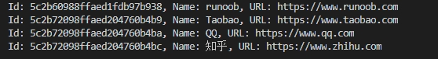

        - 还可以使用正则表达式修饰符进行查询，正则表达式只用于搜索字符串字段
            ```
                # mongo/find_by_regex.py
                import pymongo
                client = pymongo.MongoClient('mongodb://localhost:27017/')
                db = client['runoob']
                collection = db['sites']
                # 获取 name 字段中第一个字符为 'G' 的数据
                sites = collection.find({'name':{'$regex': '^G'}})
                for site in sites:
                    print('Id: {}, Name: {}, URL: {}'.format(site['_id'], site['name'], site['url']))
            ```
            - 执行效果

                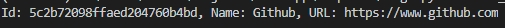

    - 指定返回条数记录
        - 对查询结果设置指定条数的记录可以使用 `limit()` 方法，该方法只接收一个数字参数
            ```
                # mongo/find_limit.py
                import pymongo
                client = pymongo.MongoClient('mongodb://localhost:27017/')
                db = client['runoob']
                collection = db['sites']
                # 返回3条记录
                sites = collection.find().limit(3)
                for site in sites:
                    print('Id: {}, Name: {}, URL: {}'.format(site['_id'], site['name'], site['url']))
            ```
            - 执行效果

                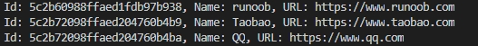

- 修改文档
    - 使用 `update_one()` 方法修改文档中的记录
    - 该方法接收两个参数，第一个是查询的条件，第二个是要修改的字段
    - 如果查找到的匹配数据多于一条，则只会修改第一条记录
        ```
            # mongo/update_one.py
            import pymongo
            client = pymongo.MongoClient('mongodb://localhost:27017/')
            db = client['runoob']
            collection = db['sites']
            # 输出修改前的所有记录
            print('Before update:')
            sites = collection.find()
            for site in sites:
                print(site)
            # 查询 name 字段中含有 'oo' 字符的记录，将第一条记录的 alexa 属性修改为 '12345'
            collection.update_one({'name': {'$regex': 'oo'}}, {'$set': {'alexa': '12345'}})
            # 输出修改后的所有记录
            print('After update:')
            sites = collection.find()
            for site in sites:
                print(site)
        ```
        - 执行效果

            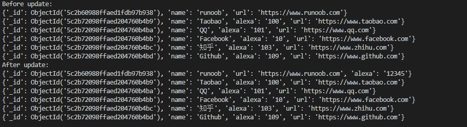
    - 可以使用 `update_many()` 修改所有匹配的记录
    - `update_one` 和 `update_many` 方法的返回结果都有一个 `modified_count` 属性，表示成功修改的记录的条数
        ```
            # mongo/update_many.py
            import pymongo
            client = pymongo.MongoClient('mongodb://localhost:27017/')
            db = client['runoob']
            collection = db['sites']
            # 输出修改前的所有记录
            print('Before update:')
            sites = collection.find()
            for site in sites:
                print(site)
            # 查询 name 字段中含有 'oo' 字符的记录，将第一条记录的 alexa 属性修改为 '123'
            result = collection.update_many({'name': {'$regex': 'oo'}}, {'$set': {'alexa': '123'}})
            print(u'成功修改 {} 条记录'.format(result.modified_count))
            # 输出修改后的所有记录
            print('After update:')
            sites = collection.find()
            for site in sites:
                print(site)
        ```
        - 执行效果

            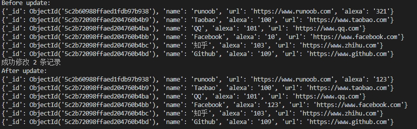

- 数据排序
    - 使用 `sort()` 方法可以指定升序或降序培训
    - `sort()` 方法第一个参数为要排序的字段，第二个参数指定排序规则：1为升序，-1为降序，默认升序
        ```
            import pymongo
            client = pymongo.MongoClient('mongodb://192.168.18.16:27017/')
            db = client['runoob']
            collection = db['sites']
            # 查询所有记录并按 'alexa' 字段降序排序
            sites = collection.find().sort('alexa', -1)
            for site in sites:
                print(site)
        ```
        - 执行效果

            
- 删除数据
    - 使用 `delete_one` 方法删除一个文档，使用 `delete_many` 方法删除多个文档
    - 这两个方法第一个参数为查询对象，指定要删除那些数据
    - 返回结果对象有一个属性 `deleted_count`，表示成功删除的记录条数
        ```
            # mongo/delete_one.py
            import pymongo
            client = pymongo.MongoClient('mongodb://localhost:27017/')
            db = client['runoob']
            collection = db['sites']
            # 输出删除前的所有记录
            print('Before deleted:')
            sites = collection.find()
            for site in sites:
                print(site)
            # 删除 name 字段中含有 'oo' 字符的第一条记录
            result = collection.delete_one({'name': {'$regex': 'oo'}})
            print(u'成功删除 {} 条记录'.format(result.deleted_count))
            # 输出删除后的所有记录
            print('After deleted:')
            sites = collection.find()
            for site in sites:
                print(site)
        ```
        - 执行效果

            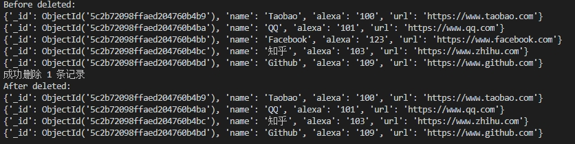
    
        ```
            # mongo/delete_many.py
            import pymongo
            client = pymongo.MongoClient('mongodb://localhost:27017/')
            db = client['runoob']
            collection = db['sites']
            # 输出删除前的所有记录
            print('Before deleted:')
            sites = collection.find()
            for site in sites:
                print(site)
            # 删除 name 字段中含有 'oo' 字符的第一条记录
            result = collection.delete_one({'name': {'$regex': 'oo'}})
            print(u'成功删除 {} 条记录'.format(result.deleted_count))
            # 输出删除后的所有记录
            print('After deleted:')
            sites = collection.find()
            for site in sites:
                print(site)
        ```
        - 执行效果：

            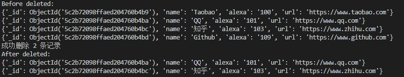

    - 删除集合中所有文档
        - 使用 `delete_many()` 方法且传入一个空的查询对象时会删除集合中的所有文档
            ```
                # mongo/delete_all.py
                import pymongo
                client = pymongo.MongoClient('mongodb://localhost:27017/')
                db = client['runoob']
                collection = db['sites']
                # 输出删除前的所有记录
                print('Before deleted:')
                sites = collection.find()
                for site in sites:
                    print(site)
                # 删除所有记录
                result = collection.delete_many({})
                print(u'成功删除 {} 条记录'.format(result.deleted_count))
                # 输出删除后的所有记录
                print('After deleted:')
                sites = collection.find()
                print('Count of sites:', sites.count())

                # 查看集合是否还存在
                collections = db.list_collection_names()
                if 'sites' in collections:
                    print('集合还存在')
                else:
                    print('集合已不存在')
            ```
            - 执行效果

                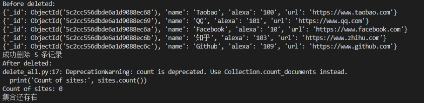

    - 删除集合
        - 使用 `drop()` 方法删除一个集合
            ```
                # mongo/drop_sites.py
                import pymongo
                client = pymongo.MongoClient('mongodb://localhost:27017/')
                db = client['runoob']
                collection = db['sites']
                # 删除集合前查看集合是列表
                print('Before droped:')
                collections = db.list_collection_names()
                print('collections', collections)
                # 删除集合后查看集合列表
                collection.drop()
                print('After droped:')
                collections = db.list_collection_names()
                print('collections', collections)
            ```
            - 执行效果

                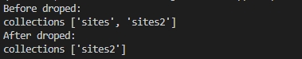
## uwsgi 安装配置
- `python` 的 `Web` 框架自带的 `Web` 服务器一般用于开发环境，而不是生产环境
- `WSGI(Web Server Gateway Interface)` 标准规定了一种在 `Web` 服务器和 `Web` 应用框架/程序之间的接口
- `uwsgi` 是一个 `Web` 服务器，实现了 `WSGI`、`uwsgi`、`http` 等协议，其中 `uwsgi` 协议是 `uwsgi` 服务器自带的协议，用于在 `uwsgi` 服务器和其它网络服务器之间的数据通信
### python 安装 uwsgi
- 虚拟环境下使用 `pip install uwsgi` 命令安装
### 第一个 WSGI 应用
- 从 `Hello World` 开始
    ```
        # hello.py
        def application(env, start_response):
            start_response('200 OK', [('Content-Type', 'text/html')])
            return [b'Hello World!']
    ```
    - 函数定义为 `application` 是因为 `uWSGI Python` 加载器默认会搜索 `application()`
- 将其部署 `HTTP` 端口 8000
    - 启动 `uWSGI` 来运行一个 `HTTP` 服务器/路由器，传递用户请求到 `WSGI` 应用
        `wsgi --http :8000 --wsgi-file hello.py`
    - 此时会出现如下异常：

        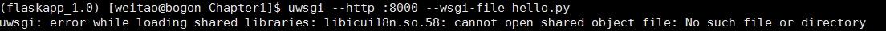
        - 使用 `ldd` 查看缺少的包
            `ldd $ANACONDA_INSTALL_PATH/envs/flaskapp_1.0/bin/uwsgi`

            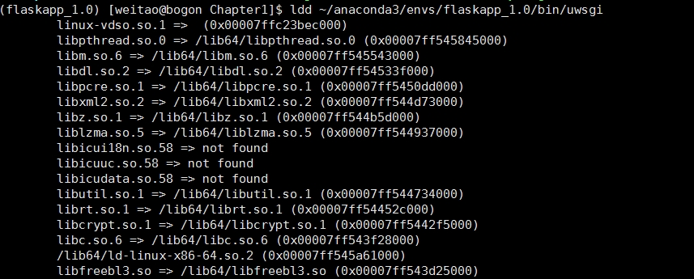
        - 发现 `uwsgi` 缺少三个包，把 `anaconda3/lib` 下相应的包软链接到 `/lib64` 下
            ```
                # ln -s $ANACONDA_INSTALL_PATH/lib/libicui18n.so.58 /lib64/libicui18n.so.58
                # ln -s $ANACONDA_INSTALL_PATH/lib/libicuuc.so.58 /lib64/libicuuc.so.58
                ln -s $ANACONDA_INSTALL_PATH/lib/libicudata.so.58 /lib64/libicudata.so.58
            ```
    - 链接完成后再次运行 `uwsgi` 发现缺少 `CXXABI_1.3.8` 及 `CXXABI_1.3.9` 等

        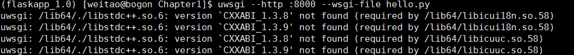
        - 需要把 `anaconda3` 下的 `libstdc++.so.6` 移到 `/lib64` 下，而且 `libstdc++.so.6` 就是 `libstdc++.so.6.0.24` 的软链接，进行如下操作：
            ```
                # cp $ANACONDA3_INSTALL_PATH/lib/libstdc++.so.6.0.24 /lib64/
                # rm -rf /lib64/libstdc++.so.6
                # ln -s /lib64/libstdc++.so.6.0.24 /lib64/libstdc++.so.6
            ```
    - 再次在虚拟环境下运行 `uwsgi --http :8000 --wsgi-file hello.py` 启动应用
    - 访问 `uwsgi` 应用服务：
        

- 如果有前端 `Web` 服务器（如 `Nginx`）时，不要使用 `--http` 选项，而是要使用 `--http-socket` 选项

### 添加并发和应用
- 默认情况下，`uWSGI` 启动一个单一的进程和单一的线程
- 可以使用 `--processes` 添加更多的进行，或者使用 `--threads` 来添加更多的线程：
    ```
        uwsgi --http :8000 --usgi-file hello.py --master --processes 4 --threads 2
    ```
    - 上述命名会产生4个进程（每个进行2个线程），一个主进程以及 `HTTP` 路由器
- 还可以使用 `--stats` 选项添加监控，可以以 `JSON` 格式输出 `uWSGI` 内部数据到某个端口
- 也可以安装 `uwsgitop` （`pip install uwsgitop`）来查看监控数据

### 结合 Web 服务器使用
- 可以将 `uwsgi` 和 `Nginx` 服务器结合使用，实现更高的并发性能
- 安装 `Nginx`:
    ```
        # yum install gcc gcc-c++
        # yum install pcre pcre-devel
        # yum install zlib zlib-devel
        # yum install openssl openssl-devel
        # wget https://nginx.org/download/nginx-1.12.2.tar.gz
        # tar xvzf nginx-1.12.2.tar.gz
        # cd nginx
        # ./configure --prefix=/usr/local/nginx         # 配置 Nginx 的安装目录
        # make && make install
    ```
- 启动/停止 `Nginx`
    ```
        # cd /usr/local/nginx/sbin
        # ./nginx               # 启动服务器
        # ./nginx -s quit       # 等待 nginx 进程处理完任务后停止
        # ./nginx -s stop       # 查出 nginx 进程 id 然后用 kill 命令直接杀死进程
        # ./nginx -s reload     # 重启 nginx
    ```
- 启动服务器后，执行 `curl http://localhost/`，效果如下：

    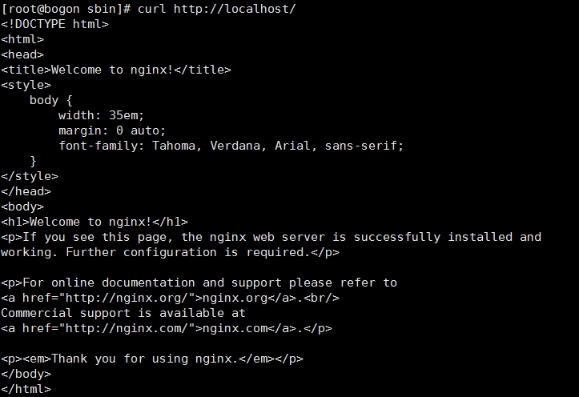

- 设置开机自启动
    - 在 `/lib/systemd/system` 目录下新建文件 `nginx.service`：
        ```
            # /lib/systemd/system/nginx.service
            [Unit]
            Description=The NGINX HTTP and reverse proxy server
            After=syslog.target network.target remote-fs.target nss-lookup.target

            [Service]
            Type=forking
            PIDFile=/usr/local/nginx/logs/nginx.pid
            ExecStartPre=/usr/local/nginx/sbin/nginx -t
            ExecStart=/usr/local/nginx/sbin/nginx
            ExecReload=/usr/local/nginx/sbin/nginx -s reload
            ExecStop=/bin/kill -s QUIT $MAINPID
            PrivateTmp=true

            [Install]
            WantedBy=multi-user.target
        ```
    - 设置权限：`chmod 754 nginx.service`
    - 启动、关闭服务，设置开机自启动
        ```
            # 启动服务
            # systemctl start nginx.service
            # 关闭服务
            # systemctl stop nginx.service
            # 设置开机自启动
            # systemctl enable nginx.service
        ```
    - 修改 `/usr/local/nginx/conf/nginx.conf` 文件来配置 `nginx` 并使用 `uwsgi` 模块
        ```
            # /usr/local/nginx/conf/nginx.conf
            service {
                listen 8000;        # 监听 8000 端口
                ......
                location / {
                    include uwsgi_params;
                    uwsgi_pass 127.0.0.1:4021;  # 将 nginx 接收的 Web 请求传递给运行在 4021 端口的 uwsgi 服务来处理
                }
            }
        ```
- 启动 `uWSGI` 服务
    ```
        uwsgi --socket 127.0.0.1:4021 --wsgi-file hello.py --master --process 4 --thread 2
    ```
    - 通过浏览器访问 `localhost:8000/`，效果如下：

        
- 通过 `uwsgi.ini` 配置文件启动 `uWSGI` 服务
    ```
        # uwsgi.ini
        [uwsgi]
        socket = 127.0.0.1:4021             # 服务运行在本机的 4021 端口
        chdir = /home/weitao/projects
        uwsgi-file = FlaskApp/Chapter1/hello.py
        processes = 4
        threads = 2
        master = 1                          # 主线程

        pidfile = %(chdir)/uwsgi/uwsgi.pid
        stats = %(chdir)/uwsgi/uwsgi.status
    ```
    - 在虚拟环境中运行 `uwsgi --ini uwsgi.ini` 启动 `uWSGI` 服务
    - 通过浏览器访问 `Web` 服务器的 `8000` 端口，效果和命令行启动 `uWSGI` 服务一致
- 设置 `uWSGI` 服务开机自启动
    - 创建文件 `/lib/systemd/system/uwsgi.service`
        ```
            # /lib/systemd/system/uwsgi.service
            [Unit]
            Description=uwsgi
            After=network.target

            [Service]
            Type=forking
            PIDFile=/home/weitao/projects/uwsgi/uwsgi.pid
            ExecStart=/home/weitao/anaconda3/envs/flaskapp_1.0/bin/uwsgi --ini /home/weitao/projects/uwsgi.ini
            ExecReload=/home/weitao/anaconda3/envs/flaskapp_1.0/bin/uwsgi --reload $PIDFile
            ExecStop=/home/weitao/anaconda3/envs/flaskapp_1.0/bin/uwsgi --stop $PIDFile
            PrivateTmp=true

            [Install]
            WantedBy=multi-user.target
        ```
    - 设置权限：`chmod 754 uwsgi.service`
    - 启动、关闭服务，设置开机自启动
        ```
            # 启动服务
            # systemctl start uwsgi.service
            # 关闭服务
            # systemctl stop uwsgi.service
            # 设置开机自启动
            # systemctl enable uwsgi.service
        ```
- 部署 `Flask`
    - 修改 `uwsgi.ini` 配置文件，将 `uwsgi-file` 配置项设置为 `Flask` 应用的入口文件，添加 `callable` 配置项设置为 `Flask` 应用的名称，如 `callable = app`


    
        
    


[下一章 程序的基本结构](../Chapter2/note.md)