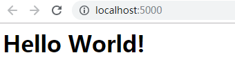
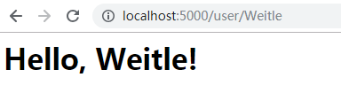

# 程序的基本结构
- 本章将编写并运行第一个 `Flask Web` 程序
## 初始化
- 所有 `Flask` 程序都必须创建一个程序实例，`Web` 服务器使用 `WSGI` 协议把接收自客户端的所有请求都转交给这个实例对象处理
- 程序实例是一个 `Flask` 类对象，使用如下方式创建：
    ```
        from flask import Flask
        app = Flask(__name__)
    ```
## 路由和视图函数
- 浏览器将请求发送给 `Web` 服务器，服务器再把请求发送给 `Flask` 程序实例
- 程序实例需要知道对每个 `URL` 运行哪些业务代码，保存了一个 `URL` 到 `Python` 函数的映射关系，处理 `URL` 和函数之间关系的程序称为路由
- 在 `Flask` 程序中使用 `app.route` 装饰器定义路由，将装饰的函数注册为路由，如：
    ```
        @app.route('/)
        def index():
            return '<h1>Hello World!</h1>'
    ```
    - 将 `index` 函数注册为 `/` 的处理程序，在浏览器对 `/` 的访问会触发服务器执行 `index` 函数
    - 处理路由请求的函数称为视图函数，视图函数的返回值称为响应，是客户端接收到的内容
- 动态路由：很多 `URL` 地址中会包含动态部分，如：
    ```
        @app.route('/user/<name>')
        def user(name):
            return '<h1>Hello, %s!</h1>' % name
    ```
    - `<name>` 就是动态部分，调用视图函数时，`Flask` 会将动态部分作为参数传入函数
    - 路由中的动态部分默认使用字符串，但也可以使用类型定义，如 `/user/<int:id>` 只会匹配 `id` 为整数的 `URL`
## 启动服务器
- 使用 `export FLASK_APP=app_name.py`（`Windows` 下使用 `set FLASK_APP=app_name.py`）设置 `FLASK_APP` 环境变量
- 然后调用 `flask run` 启动服务器
- 服务器默认监听本机的 `5000` 端口，可以通过 `--host` 和 `--port` 指定监听的主机和端口
## 一个完整的程序
- 一个完整的 `Flask` 程序示例 [hello.py](hello.py)
    ```
        from flask import Flask
        # 创建一个 `Flask` 应用程序实例
        app = Flask(__name__)
        # 绑定 `/` 路由与 `index` 视图函数
        @app.route('/')
        def index():
            return '<h1>Hello World!</h1>'
        # 动态路由
        @app.route('/user/<name>')
        def user(name):
            return '<h1>Hello, %s!</h1>' % (name,)
    ```
- 激活虚拟环境 `source activate flaskapp_1.0`
- 设置环境变量 `FLASK_APP` 为 `hello.py`，设置 `FLASK_ENV` 为 `development`，然后运行 `flask run`
- 通过本机客户端访问 `http://localhost:5000/`

    

- 通过本机客户端访问 `http://localhost:5000/user/Weitle`

    
## 请求 - 响应
### 程序和请求上下文
- `Flask` 接收到客户端请求时，会执行相应的视图函数，视图函数通过访问 `request` 对象来处理请求
- 让视图函数访问 `request` 对象，可以通过将 `request` 对象当做参数传入视图函数，但这样会导致每个视图函数都要维护一个参数用于接收 `request` 对象
- `Flask` 使用上下文临时将 `request` 对象设置为全局可访问，这样视图函数就可以直接访问 `request` 对象了
- 视图函数全局方式访问 `request` 对象：
    ```
        from flask import request
        @app.route('/')
        def index():
            user_agent = request.headers.get('User-Agent')
            return '<p>Your browser is %s.</p>' % (user_agent,)
    ```
### 请求调度
- `Flask` 程序接收到客户端请求时，会通过 `URL` 路由和视图函数的映射查找到处理该请求的视图函数
- `Flask` 使用 `app.route` 装饰器或非装饰器形式的 `app.add_url_rule()` 生成映射
- `Flask` 可以每个路由指定请求方法，不同的请求方法发送相同的 `URL` 时可以调用不同的视图函数进行处理
### 请求钩子
- `Flask` 可以注册通用函数，注册的函数可以在视图函数之前或之后被调用
- 请求钩子（注册的通用函数）使用装饰器实现，`Flask` 支持4种钩子：
    - before_first_request：注册一个函数，在处理第一个请求前运行
    - before_request：注册一个函数，每次请求执行运行
    - after_request：注册一个函数，如果没有未处理的异常抛出，在每次请求之后运行
    - teardown_request：注册一个函数，即使有未处理的异常抛出，也在每次请求之后运行
- 在请求钩子函数和视图函数之间共享数据一般使用上下文全局变量 `g`
### 响应
- `Flask` 将视图函数的返回值作为响应的内容，响应可以是一个字符串，还可以将状态码作为第二个返回值添加到响应文本之后
- 视图函数可以调用 `make_response` 函数返回一个 `Response` 对象，返回这个对象之前，可以进一步设置响应
- 还可以通过重定向的方式跳转到另一个的 `URL`
- 使用 `abort` 函数生成用于处理错误的响应

[上一章 安装](../Chapter1/note.md)

[下一章 模板](../Chapter3/note.md)


