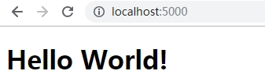
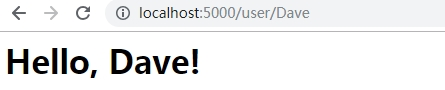

# 模板
- 使用模板将表现逻辑和业务逻辑分开，由视图函数负责业务逻辑，模板用来负责表现逻辑
- 模板是一个包含响应文本的文件，其中包含占位变量表示的动态内容，其具体值只在请求的上下文中才能知道
- 使用具体值来替代占位变量并得到最终响应字符串的过程叫做渲染
## Jinja2 模板
- `Flask` 使用 `Jinja2` 模板引擎
- 默认在应用程序目录的 `templates` 子目录中寻找模板文件
### 渲染模板
- 修改 `hello.py`，在其视图函数中分别使用对应的模板文件返回响应
    ```
        from flask import Flask, render_template

        app = Flask(__name__)

        @app.route('/')
        def index():
            # 使用 index.html 模板返回响应
            return render_template('index.html')
        @app.route('/user/<name>')
        def user(name):
            # 使用 user.html 模板返回响应
            # 并将请求路径中的参数 name 传给模板中的占位变量 name
            return render_template('user.html', name=name)
    ```
- `index` 和 `user` 视图函数分别使用 `index.html` 和 `user.html` 模板文件返回响应
    ```
        # templates/index.html
        <h1>Hello World!</h1>
    ```
    ```
        # templates/user.hmtl
        <h1>Hello, {{name}}!</h1>
    ```
- 运行服务器，访问应用，得到和第二章一致的响应
    
    `http://localhost:5000/`

    
    `http://localhost:5000/user/Dave`

    

### 变量
- `user.html` 中使用 `{{name}}` 表示一个占位变量
- `Jinja2` 能识别所有类型的变量，包括列表、字典和对象
- 还可以使用过滤器修改变量，过滤器名添加在变量名之后，用 `|` 隔开， 常用的过滤器有：`safe`、`capitalize`、`lower`、`upper`、`title`、`trim`、`striptags`等
### 控制结构
- `Jinja2` 可以使用控制语句改变模板的渲染流程
- `if` 条件控制语句
    ```
        
            <h1>Hello, {{user}}!</h1>
        
            <h1>Hello, Stranger!</h1>
        
    ```
- `for` 循环控制语句
    ```
        
            <li>{{comment}}</li>
        
    ```
- `include` 引入其他模板文件
    - 将需要在多处重复使用的模板代码片段可以写入单独文件，然后在需要使用时导入
    ```
        
    ```
- `extends` 模板继承
    ```
        # base.html
        <html>
        <head>
            
            <title> - My Application
            
        </head>
        <body>
            
        </body>
        </html>
    ```
    ```
        # index.html
        
        Index
        
            {{super()}}
            <style>
            </style>
        
        
            contents of index page
        
    ```
    - `index.html` 中使用 `` 语句继承 `base` 模板
    - 在 `index.html` 可以重新定义基模板中的块，也可以使用 {{super()}}语句获取原来的内容
