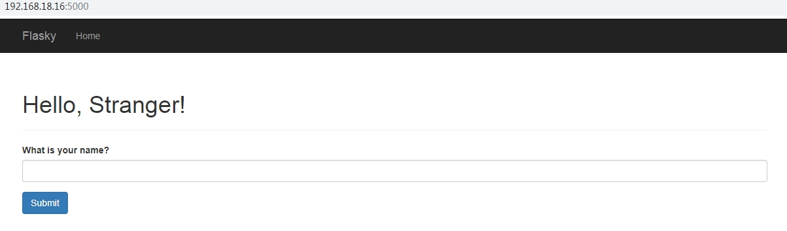
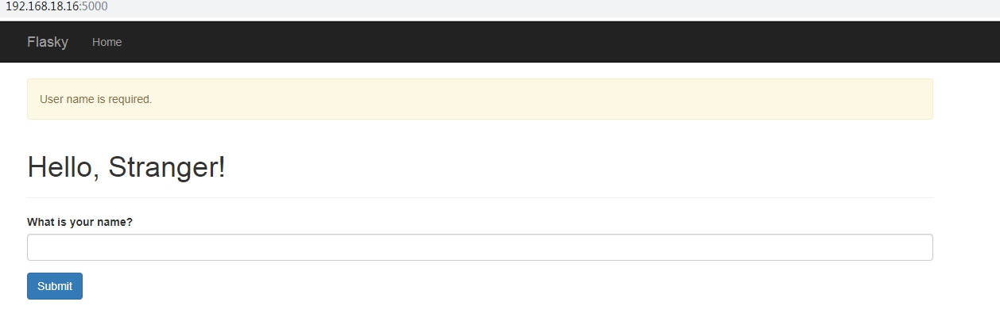
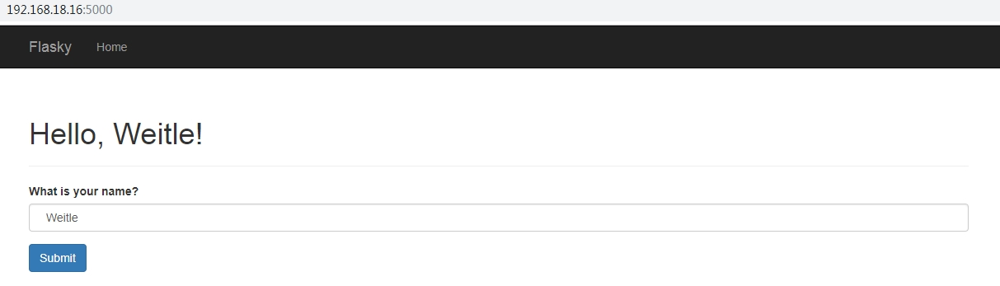

# Web 表单
- 使用 `flask-wtf` 扩展处理 `Web` 表单
- 安装：`pip install flask-wtf` （`WTForms-2.2.1 flask-wtf-0.14.2`）
## 跨站请求保护
- `Flask-WTF` 能保护 `Web` 表单免受跨站请求伪造 `CSRF` 攻击
- 为了实现 `CSRF` 保护，`Flask-WTF` 需要设置一个密钥，使用这个密钥生成加密令牌，再用加密令牌验证请求中表单数据的真伪
- 可以通过 `app.coinfig['SECRET_KEY']='somesecretkey'` 设置
- 为了增强安全性，密钥不应直接写入代码中，而是要保存在环境变量中
## 表单类
- 使用 `Flask-WTF` 时，每个 `Web` 表单都由一个继承自 `FlaskForm` 的类表示
- 表单类定义表单中的字段 `fields`，每个字段可以有一个或多个验证函数 `validators`
- 创建一个 `NameForm` 表单类，包含一个文本字段和一个提交按钮
    ```
        # hello.py
        from flask import Flask
        from flask_wtf import FlaskForm
        from wtforms import StringField, SubmitField
        from wtforms.validators import Required

        app = Flask(__name__)
        app.config['SECRET_KEY'] = b"\xef\xe2\xe9\xfaM\xca)\x13\xb8\xf0'\t\xba\x923\xec?G\x88\x8c\x17\xaf@G0\x91^\xc7\r\xd0\xca\xfe"

        class NameForm(FlaskForm):
            name = StringField('What is your name?', validators=[Required(),])
            submit = SubmitField('Submit')
    ```
- `FlaskForm` 基类从 `flask_wtf` 包中引入，字段类型和验证函数从 `wtforms` 包中引入
- `WTForms` 支持的 `HTML` 的字段类型有 `BooleanField`、`DateField`、`DateTimeField`、`DecimalField`、`FileField`、`MultipleFileField`、`FloatField`、`IntegerField`、`RadioField`、`SelectField`、`SelectMultipleField`、`SubmitField`、`HiddenFiedl`、`PasswordField`、`TextAreaField`、`FormField`、`FormList` 等
- `WTForms` 支持的验证函数有 `DataRequired`、`Email`、`EqualTo`、`InputRequired`、`Length`、`IPAddress`、`MacAddress`、`NumberRange`、`Optional`、`Regexp`、`URL`、`AnyOf`、`NoneOf` 等

## 把表单渲染成 `HTML`
- 可以在模板中调用表单字段，通过视图函数可以把一个表单类实例参数传入模板，然后在模板中生成一个表单
- `NameForm` 使用示例
    ```
        # hello.py
        # 路由'/'绑定，方式为'GET'和'POST'的请求均由'index'函数处理
        @app.route('/', methods=['GET', 'POST'])
        def index():
            err = None
            # 常见 NameForm实例，将由视图函数当做参数传给模板
            form = NameForm()
            # 'POST'请求处理
            if request.method == 'POST':
                # 对请求的'name'参数处理
                name = request.form['name'].strip()
                if not name:
                    err = 'User name is required.'
                if err is not None:
                    # 如果存在错误，将错误信息传给模板，通过闪现消息展示
                    flash(err)
                else: 
                    # form.name.data = ''
                    # 没发生错误，显示欢迎信息
                    return render_template('index.html', form=form, name=name)
            # GET请求或处理POST请求发生错误时，返回模板但不返回name参数
            return render_template('index.html', form=form)
    ```
    ```
        # templates/index.html
        
        
        
            
            <ul class="alert alert-warning">
                
                <li style="list-style:none;">{{ error }}</li>
                
            </ul>
            
        
        <div class="page-header">
            <h1>Hello, {{name}}Stranger!</h1>
        </div>
        <form action="{{url_for('index')}}" method="POST">
            {{form.csrf_token}}
            <div class="form-group">
                <label for="name">{{form.name.label.text}}</label>
                
                    <input type="text" class="form-control" id="name" name="name" value="{{form.name.data}}"/>
                
                    <input type="text" class="form-control" id="name" name="name"/>
                
            </div>
            <div class="form-group">
                <input type="submit" class="btn btn-primary" value="{{form.submit.label.text}}" />
            </div>
        </form>
        
    ```
    - 用户首次请求时，未提供 `name` 变量，浏览器显示欢迎陌生人的消息和一个表单用于用户输入 `name` 
        
        

    - 如果用户没输入名字或输入的名字只有空白字符，提交后 `Required()` 验证函数会捕捉到错误，提示用户名必须性验证错误信息

        

    - 输入合法的用户名称后，显示欢迎信息。

        

## 重定向和用户会话
- 用户输入名字后提交表单，然后再刷新页面时会显示警告信息，要求在再次提交表单前进行确认，这是由于在刷新页面时浏览器会发送之前已经发送过的最后一次请求，如果这个请求是一个包含表单数据的 `POST` 请求，刷新页面会再次提交表单
- 解决办法是不让 `Web` 程序把 `POST` 请求作为浏览器发送的最后一个请求：使用重定向作为 `POST` 请求的响应，而不是常规的响应
- 浏览器收到重定向的响应时，会向重定向的 `URL` 发起 `GET` 请求，显示页面内容
- 使用重定向时，需要保存输入的表单数据，这样重定向之后的请求才能访问通过 `POST` 请求提交的表单数据
- 可以把数据存放在用户会话中，用户会话 `session` 是一种私有存储，存在于每个链接到服务器的客户端中
- 默认情况下用户会话保存在客户端 `cookie` 中，使用设置的 `SECRET_KEY` 进行加密签名
- 重定向和用户会话示例
    ```
        # hello.py
        import os
        from flask import Flask, render_template, request, flash, redirect, url_for, session
        from flask_wtf import FlaskForm
        from wtforms import StringField, SubmitField
        from wtforms.validators import Required

        app = Flask(__name__)
        app.config['SECRET_KEY'] = os.environ.get('SECRET_KEY') or b"\xef\xe2\xe9\xfaM\xca)\x13\xb8\xf0'\t\xba\x923\xec?G\x88\x8c\x17\xaf@G0\x91^\xc7\r\xd0\xca\xfe"

        class NameForm(FlaskForm):
            name = StringField('What is your name?', validators=[Required(),])
            submit = SubmitField('Submit')
        @app.route('/welcome', methods=['GET', 'POST'])
        def welcome():
            form = NameForm()
            if request.method == 'POST':
                if form.validate_on_submit():
                    # form 字段通过验证
                    name = form.name.data.strip()
                    if name:
                        # name 不是空白字符串，写入 session
                        session['name'] = name
                        # 重定向至 /welcome 路由，以 GET 方式请求
                        return redirect(url_for('welcome'))
                else:
                    flash('User name is required.')
            return render_template('welcome.html', form=form, name=session.get('name'))
    ```
    ```
        # templates/welcome.html
        
        
        
            
            <ul class="alert alert-warning">
                
                <li style="list-style:none;">{{ error }}</li>
                
            </ul>
            
        
        <div class="page-header">
            <h1>Hello, {{name}}Stranger!</h1>
        </div>
        <form action="{{url_for('welcome')}}" method="POST">
            {{form.csrf_token}}
            <div class="form-group">
                <label for="name">{{form.name.label.text}}</label>
                <input type="text" class="form-control" id="name" name="name" value="{{name}}"/>
            </div>
            <div class="form-group">
                <input type="submit" class="btn btn-primary" value="{{form.submit.label.text}}" />
            </div>
        </form>
        
    ```
## flash 消息
- `Flask` 提供了一个闪现功能来反馈请求处理信息
- 闪现功能在请求结束时记录一个消息，提供且只提供给下一个请求使用，通常在模板中显示闪现的消息
- `flash()` 函数用于记录一个消息，`get_flashed_messages()` 用于获取消息
### 简单的例子
- 视图函数和路由
    ```
        # hello.py
        @app.route('/flash/index')
        def flash_index():
            return render_template('flash/index.html')

        @app.route('/flash/login', methods=['GET', 'POST'])
        def flash_login():
            error = None
            if request.method == 'POST':
                if request.form['username'].strip() != 'admin' or request.form['password'] != 'secret':
                    error = 'Invalid username or password.'
                else:
                    flash('You were successfully logged in.')
                    return redirect(url_for('flash_index'))
            return render_template('flash/login.html', error=error)
    ```
- 实现闪现的基本模板文件 `layout.html`
    ```
        # templates/layout.html
        <!DOCTYPE html>
        <html lang="en">
        <head>
            <meta charset="UTF-8">
            <meta name="viewport" content="width=device-width, initial-scale=1.0">
            <meta http-equiv="X-UA-Compatible" content="ie=edge">
            <title>My Application</title>
            <link rel="stylesheet" href="{{url_for('static', filename='bootstrap/css/bootstrap.min.css')}}"/>
        </head>
        <body>
            <div class="container">
                
                    
                    <ul class="alert alert-success">
                        
                            <li style="list-style:none;">{{message}}</li>
                        
                    </ul>
                    
                
                
            </div>
        </body>
        </html>
    ```
- 继承自 `layout.html` 的 `flash_index` 模板
    ```
        # templates/flash/index.html
        
        
        <h1>Overview</h1>
        <p>Do you want to <a href="{{url_for('flash_login')}}" class="btn btn-link">log in</a>?</p>
        
    ```
- 继承自 `layout.html` 的 `flash_login` 模板
    ```
        
        
        <h1>Login</h1>
        
        <div class="alert alert-danger">
            <strong>Error: </strong>{{error}}
        </div>
        
        <form action="{{url_for('flash_login')}}" method="POST">
            <dl>
                <dt>Username:</dt>
                <dd>
                    <input type="text" name="username" id="username" value="{{request.form['username']}}">
                </dd>
                <dt>Password:</dt>
                <dd>
                    <input type="password" name="password" id="password">
                </dd>
            </dl>
            <p><input type="submit" value="Login"></p>
        </form>
        
    ```
### flash 消息的类别
- 可以在 `flash()` 函数中指定闪现消息的类别：
    `flash('Invalid password provided.', 'error')`
- 默认消息的类别为 `message`
- 在模板中也可以通过 `get_flashed_message()` 函数返回消息的类别，然后根据不同的类别进行不同的展示
    ```
        
            
                <ul>
                    
                        <li class="{{category}}">{{message}}</li>
                    
                </ul>
            
        
    ```
### 过滤闪现消息
- 可以通过传递一个类别列表来过滤 `get_flashed_message()` 返回的结果，有助于在不同位置显示不同类别的消息
    ```
        
            
                <ul class="alert alert-danger">
                    
                        <li class="{{category}}">{{error}}</li>
                    
                </ul>
            
        
    ```

